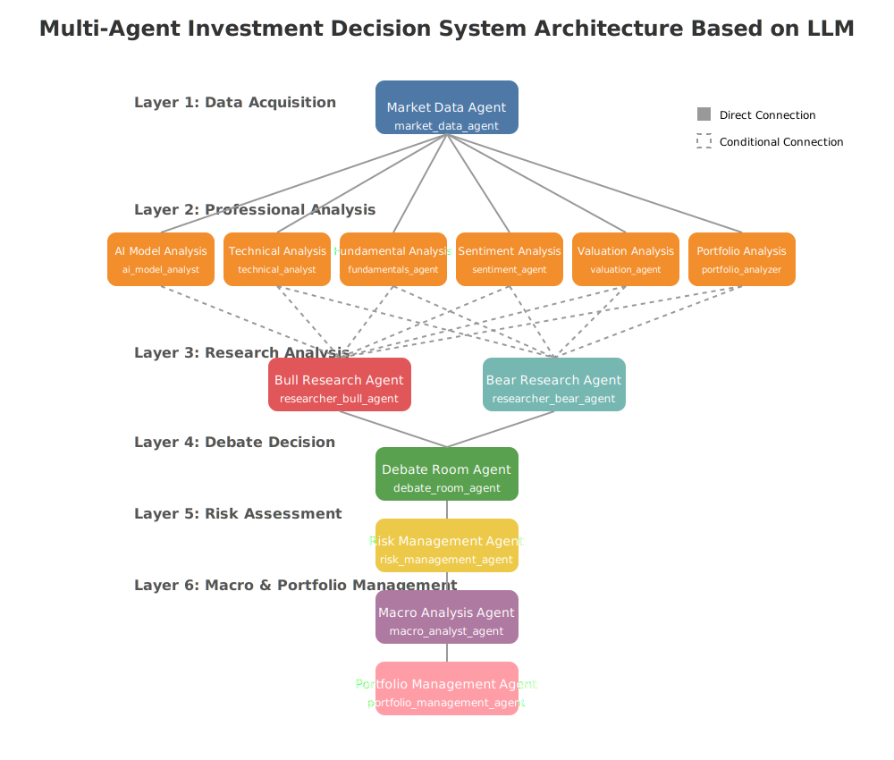

# A 股投资 Agent 系统

Forked From：https://github.com/24mlight/A_Share_investment_Agent.git



## 系统概述

这是一个基于智能体（Agent）的A股投资决策系统，通过多个专业智能体协同工作，实现数据收集、分析、决策和风险管理的全流程自动化。系统采用模块化设计，每个智能体负责特定的分析任务，最终由Portfolio Manager综合各方分析结果做出交易决策。

## 系统组成

系统由以下几个协同工作的智能体组成：

1. **Market Data Analyst** - 负责收集和预处理市场数据
2. **Technical Analyst** - 分析技术指标并生成交易信号
3. **Fundamentals Analyst** - 分析基本面数据并生成交易信号
4. **Sentiment Analyst** - 分析市场情绪并生成交易信号
5. **Valuation Analyst** - 计算股票内在价值并生成交易信号
6. **AI Model Analyst** - 运行AI模型预测并生成交易信号
7. **Macro Analyst** - 分析宏观经济环境并生成交易信号
8. **Researcher Bull** - 从多头角度分析综合研究结果
9. **Researcher Bear** - 从空头角度分析综合研究结果
10. **Debate Room** - 综合多空观点并形成平衡分析
11. **Risk Manager** - 计算风险指标并设置仓位限制
12. **Portfolio Manager** - 制定最终交易决策并生成订单

详细的智能体说明请查看 [src/agents/README.md](src/agents/README.md)。

## 环境配置

### 克隆仓库

```bash
git clone https://github.com/1517005260/stock-agent.git
cd stock-agent
```

### 使用 Conda 配置环境

1. 创建并激活 Conda 环境:

```bash
conda create -n stock python=3.10
conda activate stock
```

2. 安装依赖:

```bash
cd stock-agent/
pip install -r requirements.txt
pip install -e .
```

3. 设置环境变量:

```bash
# 创建 .env 文件存放API密钥
cp .env.example .env
```

**直接修改 .env 文件**

打开 .env 文件,填入你的 API key:

```
OPENAI_COMPATIBLE_API_KEY=your_openai_compatible_api_key
OPENAI_COMPATIBLE_BASE_URL=https://api.example.com/v1
OPENAI_COMPATIBLE_MODEL=your_model_name

TUSHARE_TOKEN=your_tushare_api_key
```

## 使用方法

### 运行方式

主程序：

```bash
# 基本用法
python -m src.main --ticker 600054 --show-reasoning

# 多资产
python src/main.py --ticker 600519 --tickers "600519,000858,601398" --start-date 2023-01-01 --end-date 2023-12-31

# 指定日期范围
python -m src.main --ticker 600054 --start-date 2023-01-01 --end-date 2023-12-31 --show-reasoning

# 指定初始资金和新闻数量
python -m src.main --ticker 600054 --initial-capital 200000 --num-of-news 10

# 显示详细的总结报告
python -m src.main --ticker 600054 --summary
```

回测：

```bash
# 基本回测
python -m src.backtester --ticker 600054

# 指定回测时间范围
python -m src.backtester --ticker 600054 --start-date 2022-01-01 --end-date 2022-12-31

# 自定义初始资金
python -m src.backtester --ticker 600054 --initial-capital 500000
```

**注意**：当前回测系统存在一个已知问题 - 在某些情况下系统可能会过度倾向于持有(hold)策略，导致长时间不交易。这可能与风险管理参数过于保守、多个分析师信号互相抵消或分析师置信度偏低有关。如果遇到此问题，可尝试调整风险参数或修改Portfolio Manager的决策逻辑。

模型训练与评估：

```bash
# 训练深度学习模型
python -m model.train.train --ticker 600054 --model dl

# 训练所有模型
python -m model.train.train --ticker 600054 --model all

# 模型评估（划分训练、验证、测试集）
python -m model.train.train --ticker 600054 --model dl --action evaluate

# 自定义数据划分比例
python -m model.train.train --ticker 600054 --model dl --action evaluate --train-ratio 0.8 --val-ratio 0.1 --test-ratio 0.1
```

数据处理工具：

```bash
# 数据分析和技术指标计算
python -m src.tools.data_analyzer --ticker 600054

# 新闻获取测试
python -m src.tools.test_news_crawler
```

### 参数说明

- `--ticker`: 股票代码（必需）
- `--tickers`: 多个股票代码，逗号分隔（可选，用于多资产分析）
- `--show-reasoning`: 显示分析推理过程（可选，默认为 false）
- `--summary`: 显示汇总报告（可选，默认为 false）
- `--initial-capital`: 初始现金金额（可选，默认为 100,000）
- `--initial-position`: 初始持仓数量（可选，默认为 0）
- `--num-of-news`: 情绪分析使用的新闻数量（可选，默认为 5）
- `--start-date`: 分析开始日期（可选，格式为 YYYY-MM-DD，默认为结束日期前一年）
- `--end-date`: 分析结束日期（可选，格式为 YYYY-MM-DD，默认为昨天）

### 命令行模式输出说明

系统会输出以下信息：

1. 基本面分析结果
2. 估值分析结果
3. 技术分析结果
4. 情绪分析结果
5. 风险管理评估
6. 最终交易决策

如果使用了`--show-reasoning`参数，还会显示每个智能体的详细分析过程。
如果使用了`--summary`参数，会在分析结束后显示一个格式化的汇总报告。

**示例输出:**

```
--- Finished Workflow Run ID: c94a353c-8d28-486e-b5e7-9e7f92a1b7c4 ---
2025-05-07 19:56:56 - structured_terminal - INFO -
════════════════════════════════════════════════════════════════════════════════
                               股票代码 600054 投资分析报告
════════════════════════════════════════════════════════════════════════════════
                         分析区间: 2023-01-01 至 2025-05-06

╔═══════════════════════════════════ 📈 技术分析分析 ═══════════════════════════════════╗
║ 信号: 📈 bullish
║ 置信度: 34%
║ ├─ signal: bullish
║ ├─ confidence: 0.3369
║ ├─ market_regime: mean_reverting
║ ├─ regime_confidence: 0.5000
║ ├─ strategy_weights:
║   ├─ trend: 0.2000
║   ├─ mean_reversion: 0.4500
║   ├─ momentum: 0.1500
║   ├─ volatility: 0.1500
║   └─ stat_arb: 0.0500
║ └─ strategy_signals:
║   ├─ trend_following:
║     ├─ signal: neutral
║     ├─ confidence: 0.5000
║     └─ metrics:
║       ├─ adx: 17.4486
║       └─ trend_strength: 0.1745
║   ├─ mean_reversion:
║     ├─ signal: neutral
║     ├─ confidence: 0.2400
║     └─ metrics:
║       ├─ z_score: -0.6314
║       ├─ price_vs_bb: 0.2563
║       ├─ rsi_14: 39.8467
║       ├─ rsi_28: 48.0707
║       ├─ avg_deviation: -0.0200
║       ├─ k_percent: 21.0145
║       ├─ d_percent: 17.7575
║       └─ signal_score: 0
║   ├─ momentum:
║     ├─ signal: neutral
║     ├─ confidence: 0.2000
║     └─ metrics:
║       ├─ momentum_1m: -0.0260
║       ├─ momentum_3m: 0.0782
║       ├─ momentum_6m: 0.0280
║       ├─ relative_strength: 0.0983
║       ├─ volume_trend: 0.8827
║       └─ divergence: -0.1343
║   ├─ volatility:
║     ├─ signal: bullish
║     ├─ confidence: 0.7000
║     └─ metrics:
║       ├─ historical_volatility: 0.4362
║       ├─ volatility_regime: 1.5622
║       ├─ volatility_z_score: 0.5622
║       ├─ atr_ratio: 0.0304
║       ├─ garch_vol_trend: -0.2795
║       ├─ garch_forecast_quality: 0.8000
║       └─ garch_results:
║         ├─ model_type: GARCH(1,1)
║         ├─ parameters:
║           ├─ omega: 0.0000
║           ├─ alpha: 0.1484
║           ├─ beta: 0.7570
║           └─ persistence: 0.9054
║         ├─ log_likelihood: 1424.2592
║         ├─ forecast:
║           ├─ 0.01934439715669238
║           ├─ 0.01947384175695497
║           ├─ 0.019590300231429235
║           ├─ 0.01969514513510902
║           ├─ 0.01978959022705738
║           ├─ 0.019874711562961323
║           ├─ 0.019951465249916377
║           ├─ 0.020020702495460313
║           ├─ 0.020083182443127238
║           └─ 0.02013958318202366
║         └─ forecast_annualized:
║           ├─ 0.307082784834438
║           ├─ 0.3091376541595679
║           ├─ 0.31098637512871713
║           ├─ 0.31265073637693247
║           ├─ 0.3141500057320084
║           ├─ 0.315501265048413
║           ├─ 0.3167196920557553
║           ├─ 0.31781879925478945
║           ├─ 0.31881063767551954
║           └─ 0.3197059716488009
║   └─ statistical_arbitrage:
║     ├─ signal: neutral
║     ├─ confidence: 0.5000
║     └─ metrics:
║       ├─ hurst_exponent: 0.00000
║       ├─ skewness: -0.8531
║       └─ kurtosis: 4.0486
╚══════════════════════════════════════════════════════════════════════════════╝

╔══════════════════════════════════ 📝 基本面分析分析 ══════════════════════════════════╗
║ 信号: 📈 bullish
║ 置信度: 50%
║ ├─ signal: bullish
║ ├─ confidence: 50%
║ └─ reasoning:
║   ├─ profitability_signal:
║     ├─ signal: neutral
║     └─ details: ROE: 12.00%, Net Margin: 15.00%, Op Margin: 18.00%
║   ├─ growth_signal:
║     ├─ signal: bearish
║     └─ details: Revenue Growth: 10.00%, Earnings Growth: 8.00%
║   ├─ financial_health_signal:
║     ├─ signal: bullish
║     └─ details: Current Ratio: 1.50, D/E: 0.40
║   └─ price_ratios_signal:
║     ├─ signal: bullish
║     └─ details: P/E: 57.18, P/B: 1.80, P/S: 3.00
╚══════════════════════════════════════════════════════════════════════════════╝

╔═══════════════════════════════════ 🔍 情感分析分析 ═══════════════════════════════════╗
║ 信号: 📈 bullish
║ 置信度: 90%
║ ├─ signal: bullish
║ ├─ confidence: 90%
║ └─ reasoning: Based on 5 recent news articles, sentiment score: 0.90
╚══════════════════════════════════════════════════════════════════════════════╝

╔═══════════════════════════════════ 💰 估值分析分析 ═══════════════════════════════════╗
║ 信号: 📈 bullish
║ 置信度: 62%
║ ├─ signal: bullish
║ ├─ confidence: 0.6250
║ ├─ valuation_gap: 9.5668
║ ├─ all_valuations:
║   ├─ Agent 1:
║       ├─ method: DCF
║       ├─ value: $156.95B
║       └─ weight: 0.3500
║   ├─ Agent 2:
║       ├─ method: Owner Earnings
║       ├─ value: $97.82B
║       └─ weight: 0.3500
║   ├─ Agent 3:
║       ├─ method: Relative Valuation
║       ├─ value: 18.3600
║       └─ weight: 0.1500
║   └─ Agent 4:
║       ├─ method: Residual Income
║       ├─ value: 0
║       └─ weight: 0.1500
║ ├─ reasoning:
║   ├─ dcf_analysis:
║     ├─ signal: bullish
║     ├─ details: 内在价值: $156,954,655,682.63, 市值: $8,438,920,121.00, 差异: 1759.9%
║     └─ model_details:
║       ├─ stages: 多阶段DCF
║       ├─ wacc: 5.0%
║       ├─ beta: 0.78
║       └─ terminal_growth: 3.0%
║   ├─ owner_earnings_analysis:
║     ├─ signal: bullish
║     ├─ details: 所有者收益价值: $97,823,398,513.58, 市值: $8,438,920,121.00, 差异: 1059.2%
║     └─ model_details:
║       ├─ required_return: 5.0%
║       ├─ margin_of_safety: 25%
║       └─ growth_rate: 8.0%
║   ├─ relative_valuation:
║     ├─ signal: bearish
║     ├─ details: 相对估值: $18.36, 市值: $8,438,920,121.00, 差异: -100.0%
║     └─ model_details:
║       ├─ pe_ratio: 57.18 (行业平均调整: 15.30)
║       ├─ pb_ratio: 1.80 (行业平均: 1.50)
║       └─ growth_premium: 0.3
║   ├─ residual_income_valuation:
║     ├─ signal: bearish
║     ├─ details: 剩余收益价值: $0.00, 市值: $8,438,920,121.00, 差异: -100.0%
║     └─ model_details:
║       ├─ book_value: $0.00
║       ├─ roe: 12.0%
║       └─ excess_return: 7.0%
║   └─ weighted_valuation:
║     ├─ signal: bullish
║     ├─ details: 加权估值: $89,172,318,971.42, 市值: $8,438,920,121.00, 差异: 956.7%
║     ├─ weights:
║       ├─ DCF: 35%
║       ├─ Owner Earnings: 35%
║       ├─ Relative Valuation: 15%
║       └─ Residual Income: 15%
║     └─ consistency: 0.50
║ └─ capm_data:
║   ├─ beta: 0.7848
║   ├─ required_return: 0.0500
║   ├─ risk_free_rate: 0.0001
║   ├─ market_return: 0.0068
║   └─ market_volatility: 0.1798
╚══════════════════════════════════════════════════════════════════════════════╝

╔═══════════════════════════════════ 🐂 多方研究分析 ═══════════════════════════════════╗
║ 置信度: 35%
║ ├─ perspective: bullish
║ ├─ confidence: 0.3524
║ ├─ thesis_points:
║   ├─ Technical indicators show bullish momentum with 0.3368983957219251 confidence
║   ├─ Strong fundamentals with 50% confidence
║   ├─ Positive market sentiment with 90% confidence
║   └─ Stock appears undervalued with 0.625 confidence
║ └─ reasoning: Bullish thesis based on comprehensive analysis of technical, fundamental, sentiment, and valuation factors
╚══════════════════════════════════════════════════════════════════════════════╝

╔═══════════════════════════════════ 🐻 空方研究分析 ═══════════════════════════════════╗
║ 置信度: 30%
║ ├─ perspective: bearish
║ ├─ confidence: 0.3000
║ ├─ thesis_points:
║   ├─ Technical rally may be temporary, suggesting potential reversal
║   ├─ Current fundamental strength may not be sustainable
║   ├─ Market sentiment may be overly optimistic, indicating potential risks
║   └─ Current valuation may not fully reflect downside risks
║ └─ reasoning: Bearish thesis based on comprehensive analysis of technical, fundamental, sentiment, and valuation factors
╚══════════════════════════════════════════════════════════════════════════════╝

╔══════════════════════════════════ 🗣️ 辩论室分析分析 ══════════════════════════════════╗
║ 信号: 📉 bearish
║ 置信度: 30%
║ ├─ signal: bearish
║ ├─ confidence: 0.3000
║ ├─ bull_confidence: 0.3524
║ ├─ bear_confidence: 0.3000
║ ├─ confidence_diff: 0.0524
║ ├─ llm_score: -0.6000
║ ��─ llm_analysis: The bullish perspective highlights several key factors such as technical indicators showing bullish momentum, strong fundamentals, positive market sentiment, and an undervalued stock. However, these points have varying levels of confidence, some of which are relatively low (e.g., technical indicators at ~0.34 confidence). Conversely, the bearish view, supported by the AI model analysis, suggests that the technical rally might be short-lived, fundamentals may not be sustainable, market sentiment ...
║ ├─ llm_reasoning: The bearish arguments are supported by a high level of confidence from AI models, indicating a stronger likelihood of a downturn. Additionally, potential over-optimism in market sentiment and risks of unsustainable fundamentals further support a cautious approach. The bullish arguments, while notable, have lower confidence levels, reducing their persuasiveness.
║ ├─ mixed_confidence_diff: -0.2536
║ ├─ debate_summary:
║   ├─ Bullish Arguments:
║   ├─ + Technical indicators show bullish momentum with 0.3368983957219251 confidence
║   ├─ + Strong fundamentals with 50% confidence
║   ├─ + Positive market sentiment with 90% confidence
║   ├─ + Stock appears undervalued with 0.625 confidence
║   ├─
Bearish Arguments:
║   ├─ - Technical rally may be temporary, suggesting potential reversal
║   ├─ - Current fundamental strength may not be sustainable
║   ├─ - Market sentiment may be overly optimistic, indicating potential risks
║   └─ - Current valuation may not fully reflect downside risks
║ ├─ reasoning: Bearish arguments more convincing
║ └─ ai_model_contribution:
║   ├─ included: ✅
║   ├─ signal: bearish
║   ├─ confidence: 0.9000
║   └─ weight: 0.1500
╚══════════════════════════════════════════════════════════════════════════════╝

╔══════════════════════════════════ ⚠️ 风险管理分析 ══════════════════════════════════╗
║ ├─ max_position_size: 2000.0000
║ ├─ risk_score: 4
║ ├─ trading_action: hold
║ ├─ risk_metrics:
║   ├─ volatility: 0.3464
║   ├─ value_at_risk_95: 0.0275
║   ├─ conditional_var_95: 0.0455
║   ├─ max_drawdown: -0.3268
║   ├─ skewness: 0.0188
║   ├─ kurtosis: 3.3005
║   ├─ sortino_ratio: 0.1112
║   ├─ market_risk_score: 4
║   ├─ stress_test_results:
║     └─ no_position: ✅
║   └─ macro_environment_assessment:
║     ├─ global_risks: ❌
║     ├─ liquidity_concerns: ❌
║     └─ volatility_regime: high
║ ├─ position_sizing:
║   ├─ kelly_fraction: 0.0500
║   ├─ win_rate: 0.4024
║   ├─ win_loss_ratio: 1.0476
║   ├─ risk_adjustment: 0.7000
║   └─ total_portfolio_value: 100000.0000
║ ├─ debate_analysis:
║   ├─ bull_confidence: 0.3524
║   ├─ bear_confidence: 0.3000
║   ├─ debate_confidence: 0.3000
║   └─ debate_signal: bearish
║ ├─ volatility_model:
║   ├─ model_type: GARCH(1,1)
║   ├─ parameters:
║     ├─ omega: 0.0000
║     ├─ alpha: 0.1484
║     ├─ beta: 0.7570
║     └─ persistence: 0.9054
║   ├─ log_likelihood: 1424.2592
║   ├─ forecast:
║     ├─ 0.01934439715669238
║     ├─ 0.01947384175695497
║     ├─ 0.019590300231429235
║     ├─ 0.01969514513510902
║     ├─ 0.01978959022705738
║     ├─ 0.019874711562961323
║     ├─ 0.019951465249916377
║     ├─ 0.020020702495460313
║     ├─ 0.020083182443127238
║     └─ 0.02013958318202366
║   └─ forecast_annualized:
║     ├─ 0.307082784834438
║     ├─ 0.3091376541595679
║     ├─ 0.31098637512871713
║     ├─ 0.31265073637693247
║     ├─ 0.3141500057320084
║     ├─ 0.315501265048413
║     ├─ 0.3167196920557553
║     ├─ 0.31781879925478945
║     ├─ 0.31881063767551954
║     └─ 0.3197059716488009
║ └─ reasoning: 风险评分 4/10: 市场风险=4, 波动率=34.64%, VaR=2.75%, CVaR=4.55%, 最大回撤=-32.68%, 偏度=0.02, 辩论信号=bearish, Kelly建议占比=0.05
╚══════════════════════════════════════════════════════════════════════════════╝

╔═══════════════════════════════════ 🌍 宏观分析分析 ═══════════════════════════════════╗
║ 宏观环境: 📈 positive
║ 对股票影响: 📈 positive
║ ● 关键因素:
║   • 消费市场复苏
║   • 财政政策支持
║   • 市场情绪改善
║   • 国际旅游限制放宽
║   • 区域经济发展
║ ● 分析摘要:
║   当前宏观经济环境对A股市场特别是文旅产业构成积极影响。首先，报道中显示黄山旅游及其他旅游公司的业绩增速显著，多次提到 旅游客流量创历史新高，显示国内旅游市场复苏。这反映出消费者内需的强劲复苏，积极影响整...
║ ├─ signal: positive
║ ├─ confidence: 0.7000
║ ├─ macro_environment: positive
║ ├─ impact_on_stock: positive
║ ├─ key_factors:
║   ├─ 消费市场复苏
║   ├─ 财政政策支持
║   ├─ 市场情绪改善
║   ├─ 国际旅游限制放宽
║   └─ 区域经济发展
║ ├─ reasoning: 当前宏观经济环境对A股市场特别是文旅产业构成积极影响。首先，报道中显示黄山旅游及其他旅游公司的业绩增速显 著，多次提到旅游客流量创历史新高，显示国内旅游市场复苏。这反映出消费者内需的强劲复苏，积极影响整个文旅行业。其次，财政政策方面可能存在对旅游及相关行业的支持，如减税、投资补助等，以推动文旅行业增长，直接有利于企业业绩提升。第三，市场情绪方面，因旅游活动及消费复苏，投资者信心增强，股市流动性增加，风险偏好上升，从而推高相关股票价格。此外，国际旅游限制的放宽可能扩大市场空间，使得行业受益，因此黄山旅游等公司盈利能力增强。最后，区域经济的发展如长三角地区的强势增长，为黄山旅游提供了进一步扩展的机遇。因此，综合来看，现有宏观经济环境及各重要因素对黄山旅游以及重仓股如黄山旅游的股价都是利好的。
║ └─ summary: 宏观环境: positive
对股票影响: positive
关键因素:
- 消费市场复苏
- 财政政策支持
- 市场情绪改善
- 国际旅游限制放宽
- 区域经济发展
╚══════════════════════════════════════════════════════════════════════════════╝

╔══════════════════════════════════ 📂 投资组合管理分析 ══════════════════════════════════╗
║ 交易行动: ⏸️ HOLD
║ 交易数量: 171
║ 决策信心: 80%
║ ● 各分析师意见:
║ ● 决策理由:
║   The decision to hold is primarily dictated by the risk management constraint
║   s which recommend holding. Despite positive signals from valuation, fundamen
║   tal, technical, macro, and sentiment analyses, AI models overwhelmingly indi
║   cate a bearish outlook with high confidence. This, combined with a risk mana
║   gement action of hold, means no position is initiated. The high bullish sent
║   iment suggests potential future opportunities, but current AI signals provid
║   e caution.

AI模型分析给出bearish信号，虽与决策方向不同，但已纳入考虑，适当调整了仓位。
║ ├─ action: hold
║ ├─ quantity: 171
║ ├─ confidence: 0.8000
║ ├─ agent_signals:
║   ├─ Agent 1:
║       ├─ agent_name: AI Models
║       ├─ signal: bearish
║       └─ confidence: 0.9000
║   ├─ Agent 2:
║       ├─ agent_name: Valuation Analysis
║       ├─ signal: bullish
║       └─ confidence: 0.6250
║   ├─ Agent 3:
║       ├─ agent_name: Fundamental Analysis
║       ├─ signal: bullish
║       └─ confidence: 0.5000
║   ├─ Agent 4:
║       ├─ agent_name: Technical Analysis
║       ├─ signal: bullish
║       └─ confidence: 0.3369
║   ├─ Agent 5:
║       ├─ agent_name: Macro Analysis
║       ├─ signal: positive
║       └─ confidence: 0.7000
║   └─ Agent 6:
║       ├─ agent_name: Sentiment Analysis
║       ├─ signal: bullish
║       └─ confidence: 0.9000
║ ├─ reasoning: The decision to hold is primarily dictated by the risk management constraints which recommend holding. Despite positive signals from valuation, fundamental, technical, macro, and sentiment analyses, AI models overwhelmingly indicate a bearish outlook with high confidence. This, combined with a risk management action of hold, means no position is initiated. The high bullish sentiment suggests potential future opportunities, but current AI signals provide caution.

AI模型分析给出bearish信号，虽与决策方向不同，但已纳入考...
║ ├─ portfolio_optimization:
║   ├─ risk_score: 4
║   ├─ kelly_fraction: 0.6000
║   ├─ risk_factor: 0.6000
║   ├─ max_position_size: 2000.0000
║   ├─ suggested_position_value: 2000.0000
║   ├─ total_portfolio_value: 100000.0000
║   ├─ position_profit_pct: 0
║   ├─ macro_adjustment: 1.0000
║   ├─ analytics:
║     ├─ multi_asset: ❌
║     ├─ expected_annual_return: 0.0201
║     ├─ expected_annual_volatility: 0.3143
║     ├─ beta_adjusted_return: 0.0201
║     ├─ sharpe_ratio: 0.0636
║     ├─ volatility_adjustment: 1.0198
║     ├─ return_multiplier: 0.8200
║     ├─ beta: 1.0000
║     ├─ market_volatility: 0.1798
║     └─ risk_free_rate: 0.0001
║   └─ market_data:
║     ├─ market_returns_mean: 0.0000
║     ├─ market_returns_std: 0.0113
║     ├─ stock_returns_mean: 0.0001
║     ├─ stock_returns_std: 0.0202
║     ├─ market_volatility: 0.1798
║     └─ stock_volatility: 0.3205
║ └─ ai_model_integration:
║   ├─ used: ✅
║   ├─ signal: bearish
║   ├─ confidence: 0.9000
║   └─ impact_on_position: 1.0000
╚══════════════════════════════════════════════════════════════════════════════╝

════════════════════════════════════════════════════════════════════════════════

Final Result:
{"action": "hold", "quantity": 171, "confidence": 0.8, "agent_signals": [{"agent_name": "AI Models", "signal": "bearish", "confidence": 0.9}, {"agent_name": "Valuation Analysis", "signal": "bullish", "confidence": 0.625}, {"agent_name": "Fundamental Analysis", "signal": "bullish", "confidence": 0.5}, {"agent_name": "Technical Analysis", "signal": "bullish", "confidence": 0.3368983957219251}, {"agent_name": "Macro Analysis", "signal": "positive", "confidence": 0.7}, {"agent_name": "Sentiment Analysis", "signal": "bullish", "confidence": 0.9}], "reasoning": "The decision to hold is primarily dictated by the risk management constraints which recommend holding. Despite positive signals from valuation, fundamental, technical, macro, and sentiment analyses, AI models overwhelmingly indicate a bearish outlook with high confidence. This, combined with a risk management action of hold, means no position is initiated. The high bullish sentiment suggests potential future opportunities, but current AI signals provide caution.\n\nAI模型分析给出bearish信号，虽与决策方向不同，但已纳入考虑，适当调整了仓位。", "portfolio_optimization": {"risk_score": 4, "kelly_fraction": 0.6000000000000001, "risk_factor": 0.6, "max_position_size": 2000.0, "suggested_position_value": 2000.0, "total_portfolio_value": 100000.0, "position_profit_pct": 0, "macro_adjustment": 1.0, "analytics": {"multi_asset": false, "expected_annual_return": 0.020056438875632077, "expected_annual_volatility": 0.31425639219149415, "beta_adjusted_return": 0.020056438875632077, "sharpe_ratio": 0.06357019014466853, "volatility_adjustment": 1.0197810629914392, "return_multiplier": 0.82, "beta": 1.0, "market_volatility": 0.17975368423841376, "risk_free_rate": 7.910026984126984e-05}, "market_data": {"market_returns_mean": 2.7084239960171616e-05, "market_returns_std": 0.01132341775577318, "stock_returns_mean": 9.705980872837823e-05, "stock_returns_std": 0.02018788364201582, "market_volatility": 0.17975368423841376, "stock_volatility": 0.3204727176808965}}, "ai_model_integration": {"used": true, "signal": "bearish", "confidence": 0.9, "impact_on_position": 1.0}}
```

### 日志文件说明

系统会在 `logs/` 目录下生成以下类型的日志文件：

1. **回测日志**

   - 文件名格式：`backtest_{股票代码}_{当前日期}_{回测开始日期}_{回测结束日期}.log`
   - 示例：`backtest_301157_20250107_20241201_20241230.log`
   - 包含：每个交易日的分析结果、交易决策和投资组合状态

2. **API 调用日志**
   - 文件名格式：`api_calls_{当前日期}.log`
   - 示例：`api_calls_20250107.log`
   - 包含：所有 API 调用的详细信息和响应

所有日期格式均为 YYYY-MM-DD。如果使用了 `--show-reasoning` 参数，详细的分析过程也会记录在日志文件中。

## 项目结构

```
stock-agent/
├── src/                         # Agent 核心逻辑和工具
│   ├── agents/                  # Agent 定义和工作流
│   │   ├── __init__.py
│   │   ├── debate_room.py
│   │   ├── fundamentals.py
│   │   ├── market_data.py
│   │   ├── portfolio_manager.py
│   │   ├── researcher_bear.py
│   │   ├── researcher_bull.py
│   │   ├── risk_manager.py
│   │   ├── sentiment.py
│   │   ├── state.py
│   │   ├── technicals.py
│   │   ├── valuation.py
│   │   ├── ai_model_analyst.py
│   │   ├── macro_analyst.py
│   │   └── README.md           # 智能体详细文档
│   ├── data/                   # 数据存储目录 (本地缓存等)
│   │   ├── img/                # 项目图片
│   │   ├── sentiment_cache.json
│   │   └── stock_news/
│   ├── tools/                  # 工具和功能模块 (LLM, 数据获取)
│   │   ├── __init__.py
│   │   ├── api.py
│   │   ├── data_analyzer.py
│   │   ├── news_crawler.py
│   │   └── factor_data_api.py
│   ├── utils/                  # 通用工具函数 (日志, LLM客户端, 序列化)
│   │   ├── __init__.py
│   │   ├── api_utils.py        # Agent 共享的API工具
│   │   ├── llm_clients.py
│   │   ├── llm_interaction_logger.py
│   │   ├── logging_config.py
│   │   ├── output_logger.py
│   │   └── serialization.py
│   ├── backtester.py          # 回测系统
│   └── main.py                # Agent 工作流定义和命令行入口
├── model/                     # 机器学习和深度学习模型
│   ├── train/                 # 模型训练脚本
│   └── predict/               # 模型预测脚本
├── logs/                      # 日志文件目录
├── factors/                   # 因子定义和计算
├── .env                       # 环境变量配置
├── .env.example               # 环境变量示例
└── README.md                  # 项目文档
```

## 架构设计

本项目是一个基于多个 agent 的 AI 投资系统，采用模块化设计，每个 agent 都有其专门的职责。系统的架构如下：

```
Market Data → [Technical/Fundamentals/Sentiment/Valuation/AI Model/Macro] → [Bull/Bear Researchers] → Debate Room → Risk Manager → Portfolio Manager → Trading Decision
```

## 数据流和处理

### 数据类型

系统处理的主要数据类型包括市场数据、财务指标数据、财务报表数据和交易信号。每种数据类型都有标准化的结构和处理流程。

### 系统特点

1. **多 LLM 支持**

   - 支持 OpenAI API
   - 支持任何兼容 OpenAI API 格式的 LLM 服务（如华为云方舟、OpenRouter 等）
   - 智能切换功能：自动选择可用的 LLM 服务

2. **模块化设计**

   - 每个代理都是独立的模块
   - 易于维护和升级
   - 可以单独测试和优化

3. **可扩展性**

   - 可以轻松添加新的分析师
   - 支持添加新的数据源
   - 可以扩展决策策略

4. **风险管理**

   - 多层次的风险控制
   - 实时风险评估
   - 自动止损机制

5. **多资产分析**
   - 支持分析多个股票
   - 提供投资组合优化建议
   - 计算相关性和风险指标

## 未来发展方向

1. 优化回测系统，解决过度持有(hold)的问题
2. 增加更多机器学习模型和因子
3. 添加更丰富的技术指标和分析方法
4. 加强宏观经济分析能力
5. 增强多资产配置和投资组合优化功能
