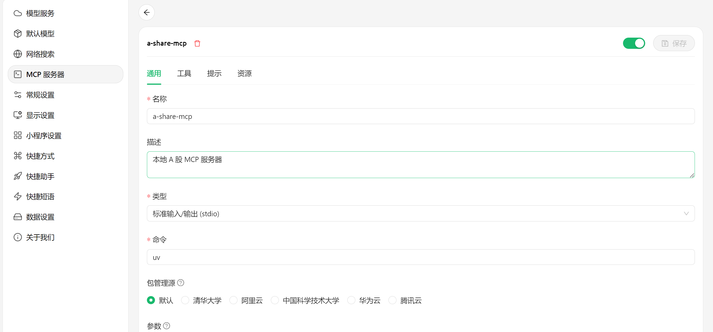
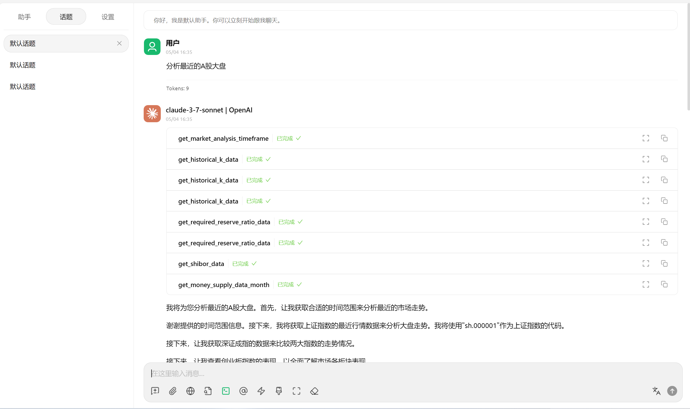
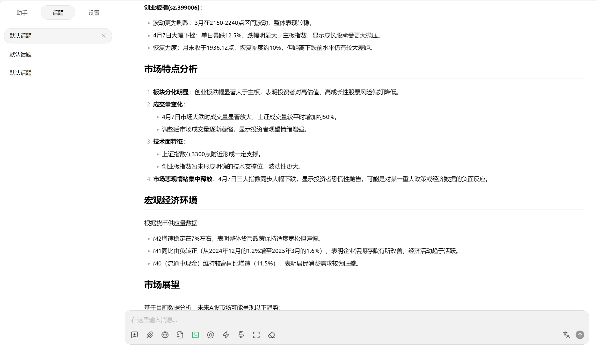
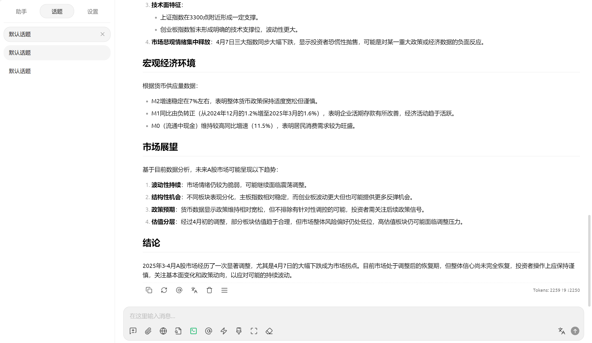

# A 股数据分析 API (MCP 版)

Forked From：https://github.com/24mlight/a-share-mcp-is-just-i-need.git

## 项目概述

这是一个基于 MCP（Model Control Protocol）架构的中国 A 股市场数据分析 API，旨在为 AI 助手提供全面的中国股市数据访问和分析能力。该项目利用 Baostock 库作为数据源，提供了丰富的股票市场数据、财务报表数据、指数成分股信息以及宏观经济数据的查询功能。

### 主要特点

- **数据全面**：覆盖 A 股历史行情、财务报表、公司信息、指数成分股、宏观经济数据等
- **架构灵活**：基于 MCP 协议，可轻松与 Claude、GPT 等大型语言模型集成
- **接口统一**：提供标准化的工具函数接口，使 AI 助手能够像专业分析师一样处理金融数据
- **错误处理**：完善的错误处理机制确保数据查询稳定可靠
- **格式友好**：返回结果以 Markdown 表格形式呈现，便于阅读和分析

## 系统架构

该项目采用模块化设计，主要组件包括：

1. **数据源接口层**：定义了金融数据源的抽象接口（`FinancialDataSource`）
2. **Baostock 实现**：基于 Baostock 库实现的具体数据源（`BaostockDataSource`）
3. **工具函数模块**：按功能分类的多个工具集合，如：
   - 股票市场数据工具
   - 财务报告工具
   - 指数工具
   - 市场概览工具
   - 宏观经济工具
   - 日期工具
   - 分析工具
4. **MCP 服务器**：对接 AI 助手的 FastMCP 服务器实现

## 安装指南

⚠️ **重要提示**：本项目必须使用 uv 进行安装，MCP 不支持其他包管理方式

```bash
# 1. 安装uv（如果尚未安装）
pip install uv

# 2. 克隆代码仓库（如果需要）
git clone https://github.com/yourusername/a-share-mcp-api.git
cd a-share-mcp-api/src/mcp_api/

# 3. 创建虚拟环境
uv venv

# 4. 激活环境
# Windows
.venv\Scripts\activate
# macOS/Linux
source .venv/bin/activate

# 5. 下载依赖包
uv sync
```

## 功能特性

### 1. 股票市场数据

- **历史 K 线数据** (`get_historical_k_data`)：获取股票价格、交易量等时间序列数据
- **基本信息** (`get_stock_basic_info`)：获取股票基本信息如股票名称、行业、上市日期等
- **分红数据** (`get_dividend_data`)：获取股票历史分红数据
- **复权因子** (`get_adjust_factor_data`)：获取价格复权所需的复权因子

### 2. 财务报告数据

- **盈利能力数据** (`get_profit_data`)：ROE、净利润率等盈利指标
- **运营能力数据** (`get_operation_data`)：资产周转率等运营指标
- **成长能力数据** (`get_growth_data`)：收入增长率、利润增长率等
- **偿债能力数据** (`get_balance_data`)：资产负债率、流动比率等
- **现金流量数据** (`get_cash_flow_data`)：经营现金流等现金流指标
- **杜邦分析数据** (`get_dupont_data`)：ROE 分解数据
- **业绩快报** (`get_performance_express_report`)：公司业绩快报数据
- **业绩预告** (`get_forecast_report`)：公司业绩预告数据

### 3. 指数数据

- **行业分类数据** (`get_stock_industry`)：获取股票所属行业信息
- **上证 50 成分股** (`get_sz50_stocks`)：获取上证 50 指数成分股
- **沪深 300 成分股** (`get_hs300_stocks`)：获取沪深 300 指数成分股
- **中证 500 成分股** (`get_zz500_stocks`)：获取中证 500 指数成分股

### 4. 市场概览数据

- **交易日期信息** (`get_trade_dates`)：获取 A 股市场交易日历
- **股票列表** (`get_all_stock`)：获取所有 A 股及其交易状态

### 5. 宏观经济数据

- **基准存款利率** (`get_deposit_rate_data`)：获取央行基准存款利率数据
- **基准贷款利率** (`get_loan_rate_data`)：获取央行基准贷款利率数据
- **存款准备金率** (`get_required_reserve_ratio_data`)：获取存款准备金率数据
- **月度货币供应量** (`get_money_supply_data_month`)：M0、M1、M2 月度数据
- **年度货币供应量** (`get_money_supply_data_year`)：M0、M1、M2 年度数据
- **SHIBOR 利率** (`get_shibor_data`)：上海银行间同业拆放利率数据

### 6. 日期工具

- **当前日期** (`get_current_date`)：获取系统当前日期
- **最近交易日** (`get_latest_trading_date`)：获取最近的 A 股交易日期
- **市场分析时间范围** (`get_market_analysis_timeframe`)：获取适用于市场分析的时间范围

### 7. 分析工具

- **股票分析报告** (`get_stock_analysis`)：获取基于数据的股票分析报告

## 使用指南

### 1. 在 Cherry Studio 中配置 MCP

首先确保您已经安装了[Cherry Studio 客户端](https://www.cherry-ai.com/)，然后进行如下配置：

1. 打开 Cherry Studio 设置
2. 在 MCP 配置部分添加新配置
3. 参数设置如下：

```
--directory
项目路径/src/mcp_api
run
python
mcp_server.py
```

**配置截图:**



#### 通过 Claude/GPT 等助手使用

配置完成后，您可以通过 AI 助手来查询和分析 A 股数据。以下是一些示例查询：

## 使用效果展示








### 2. 通过 Cline 进行配置

在 vscode 中下载 cline 插件，在 mcp 配置界面使用 json 配置：

```json
{
  "mcpServers": {
    // 其他mcp的配置....
    "a-share-mcp": {
      "timeout": 60,
      "command": "uv",
      "args": [
        "--directory",
        "C:\\path\\to\\stock_agent\\src\\mcp_api",
        "run",
        "python",
        "mcp_server.py"
      ],
      "transportType": "stdio",
      "disabled": false
    }
    // 其他mcp的配置....
  }
}
```

之后便可以进行对话

## 注意事项

1. **数据来源**：本项目使用 Baostock 作为数据源，数据仅供参考，不构成投资建议。
2. **实时性**：Baostock 数据可能存在延迟，不保证数据的实时性。
3. **使用限制**：请遵守 Baostock 的使用条款，避免频繁请求导致 IP 被限制。
4. **免责声明**：使用本项目进行投资决策风险自负，作者不对因使用本项目而导致的任何损失负责。

## 开发指南

### 扩展数据源

如需添加新的数据源（如 TuShare、AkShare 等），只需实现`FinancialDataSource`接口：

```python
from src.mcp_api.data_source_interface import FinancialDataSource

class MyNewDataSource(FinancialDataSource):
    # 实现所有抽象方法
    def get_historical_k_data(self, code, start_date, end_date, frequency, adjust_flag, fields):
        # 实现代码
        pass

    # 实现其他必要方法...
```

### 添加新工具

如需添加新的工具函数，可以在现有模块中添加或创建新模块：

```python
def register_my_new_tools(app: FastMCP, active_data_source: FinancialDataSource):
    @app.tool()
    def my_new_tool(param1: str, param2: int) -> str:
        """
        新工具函数的文档字符串，描述其功能和参数
        """
        # 实现代码
        return "结果"
```

然后在`mcp_server.py`中注册新工具模块：

```python
from src.mcp_api.mcp_tools.my_new_tools import register_my_new_tools

# 其他导入...

# 注册各模块的工具
register_my_new_tools(app, active_data_source)
# 其他注册...
```
