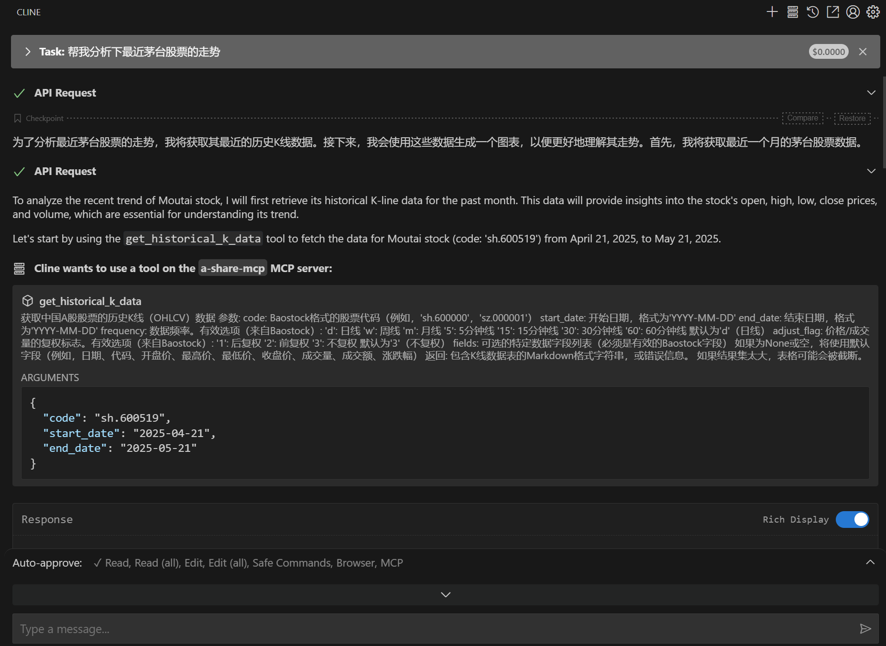
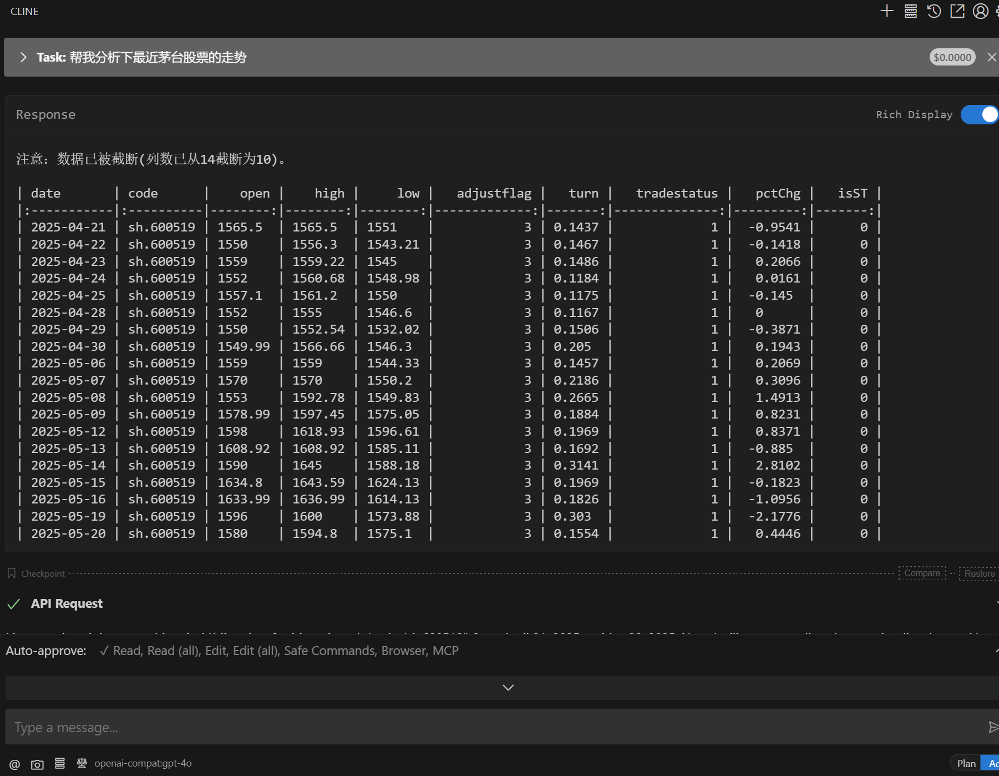
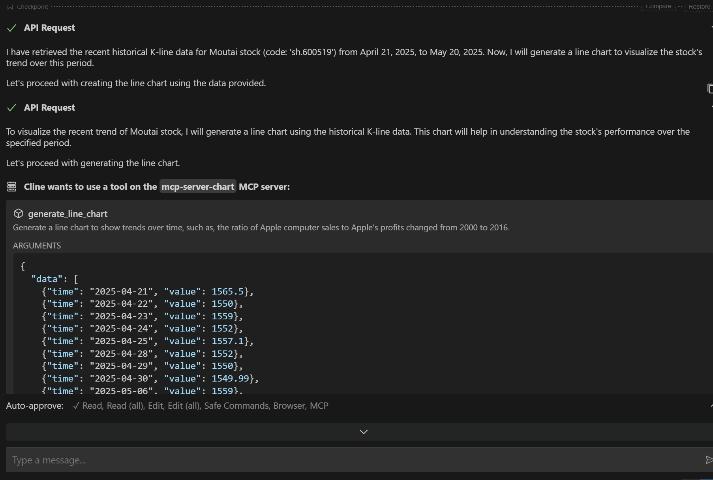
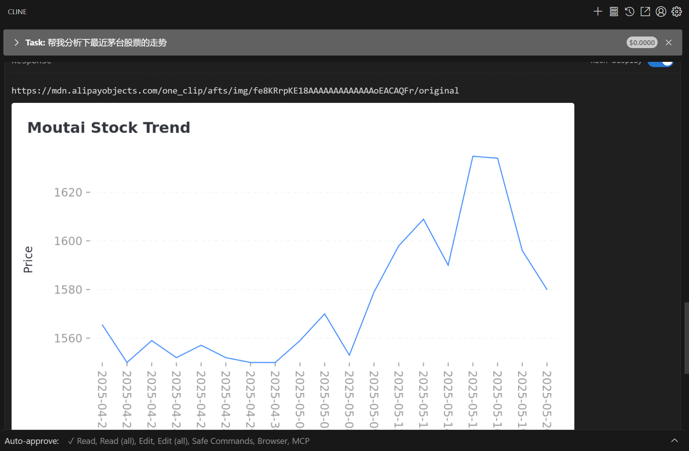
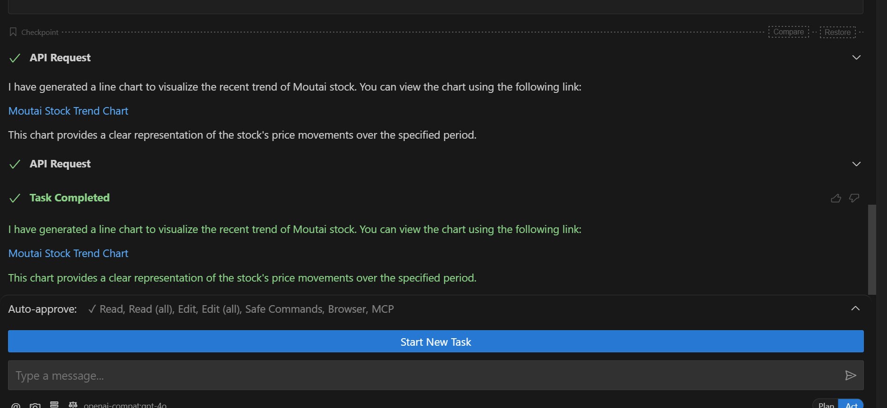

# A-Share Auxiliary Charting MCP

Forked from: https://github.com/antvis/mcp-server-chart.git

This project serves as an auxiliary MCP for `mcp_api`, used for data visualization to make AI-generated reports more beautiful.

### Usage Guide

1. First, ensure that frontend tools like `nodejs` and `npm` are installed

Verify installation:

```bash
C:\Users\15170\Desktop\stock_agent>node -v
v20.15.1

C:\Users\15170\Desktop\stock_agent>npm -v
10.7.0
```

2. Configure in Cline:

```json
{
  "mcpServers": {
    "mcp-server-chart": {
      "disabled": false,
      "timeout": 60,
      "command": "cmd",
      "args": ["/c", "npx", "-y", "@antv/mcp-server-chart"],
      "transportType": "stdio"
    }
    // Other MCP server configurations
  }
}
```

3. Combined usage effect with A-Share MCP:










